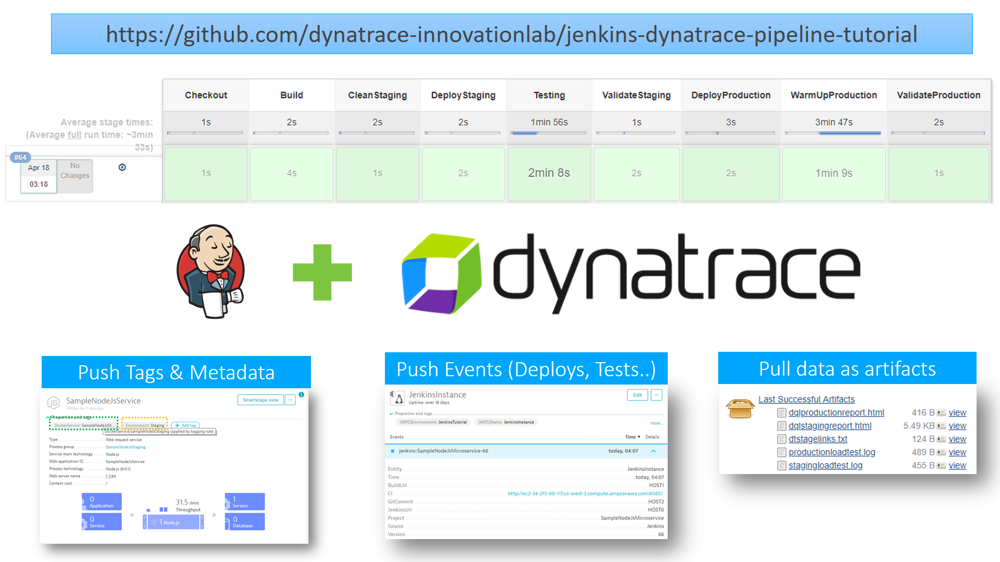
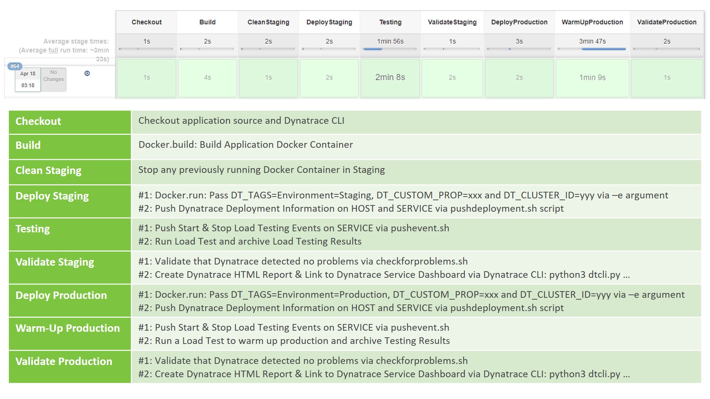

# JenkinsDynatracePipelineTutorial
Provides a full End-to-End Delivery Pipeline for a Node.js based Microservice Application using Jenkins Pipelines and Dynatrace. 

For more information check out the slide deck that is part of this repo or watch the [101 Jenkins with Dynatrace YouTube Tutorial](http://bit.ly/oneagentutorials)

## Pipeline Details
The following illustration shows the indivudal pipeline steps and explains the integration points with Dynatrace:
